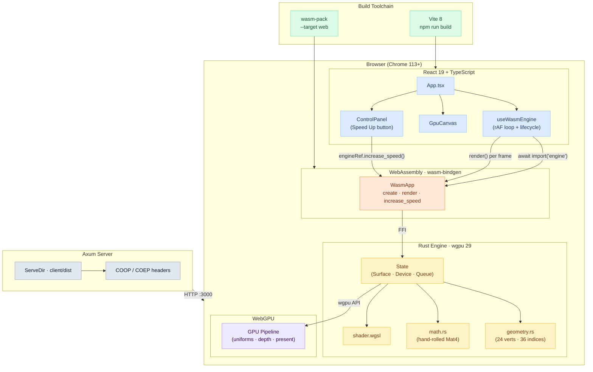
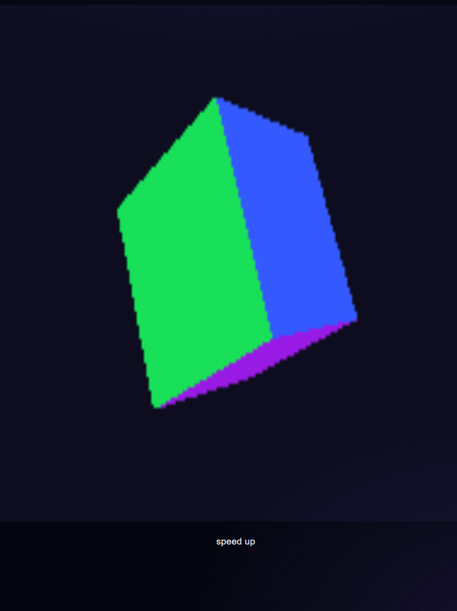

# Rust x WebAssembly x WebGPU x React

A spinning cube. A concept project integrating Rust, WebGPU, and WebAssembly to offload 3D rendering from a React-based UI.

---

## Architecture



---

## Preview



---

## Prerequisites

```bash
# Rust + wasm32 target
curl --proto '=https' --tlsv1.2 -sSf https://sh.rustup.rs | sh
rustup target add wasm32-unknown-unknown
# wasm-pack
cargo install wasm-pack
# Node.js >= 18  →  https://nodejs.org
```

---

## Installation & Running
```bash
cd engine && wasm-pack build --target web --out-dir ../client/engine-pkg
```

```bash
cd client && npm install && npm run build
```
```bash
cargo run -p server
```

Open **http://localhost:3000**.

---

## Development

After making changes, only rebuild the affected layer:

```bash
# Rust engine changed
cd engine && wasm-pack build --target web --out-dir ../client/engine-pkg
cd ../client && npm run build && cd ..
```

```bash
# React / CSS / TypeScript changed
cd client && npm run build && cd ..
```

```bash
# Vite dev server (frontend-only, hot reload)
cd client && npm run dev   # http://localhost:5173
```

---

## Project Structure

```
webassembly-webgl-rust/
├── engine/src/         # Rust → Wasm (wgpu pipeline, geometry, math, WGSL shader)
├── server/src/         # Axum static file server
└── client/src/
    ├── hooks/          # useWasmEngine (Wasm init + rAF loop)
    └── components/     # GpuCanvas, ControlPanel
```
